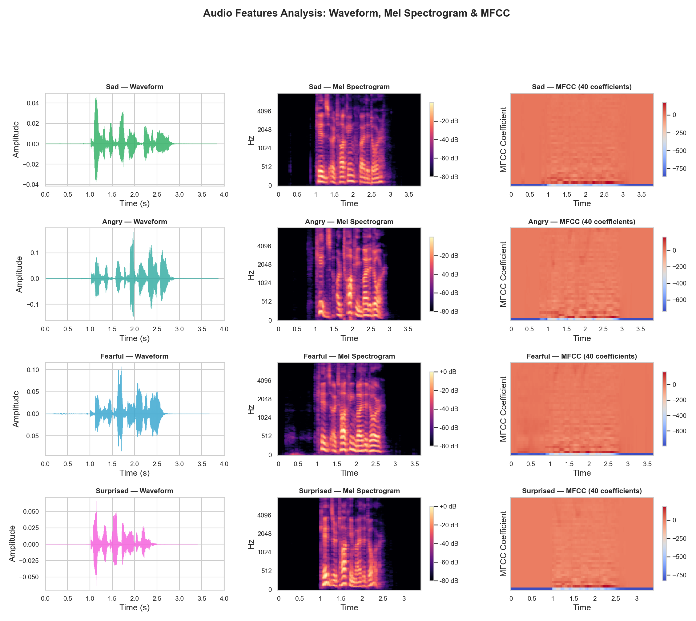
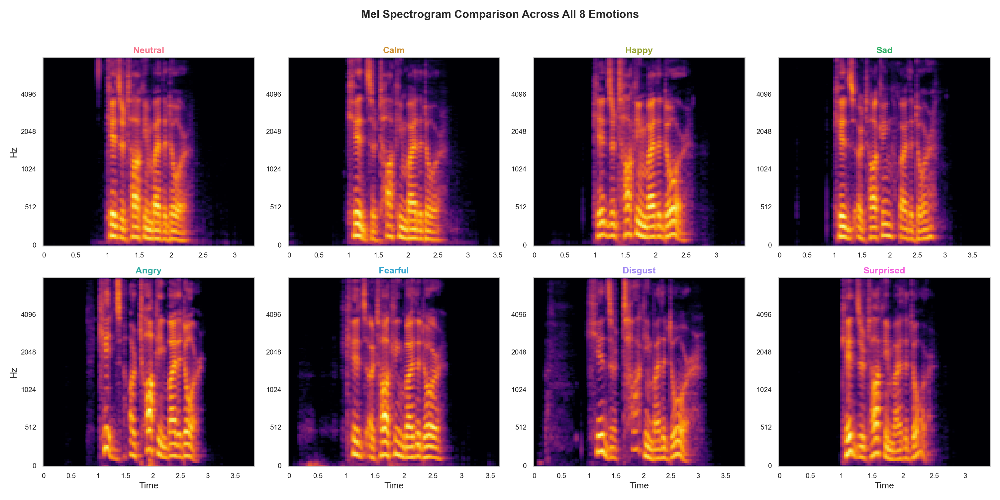
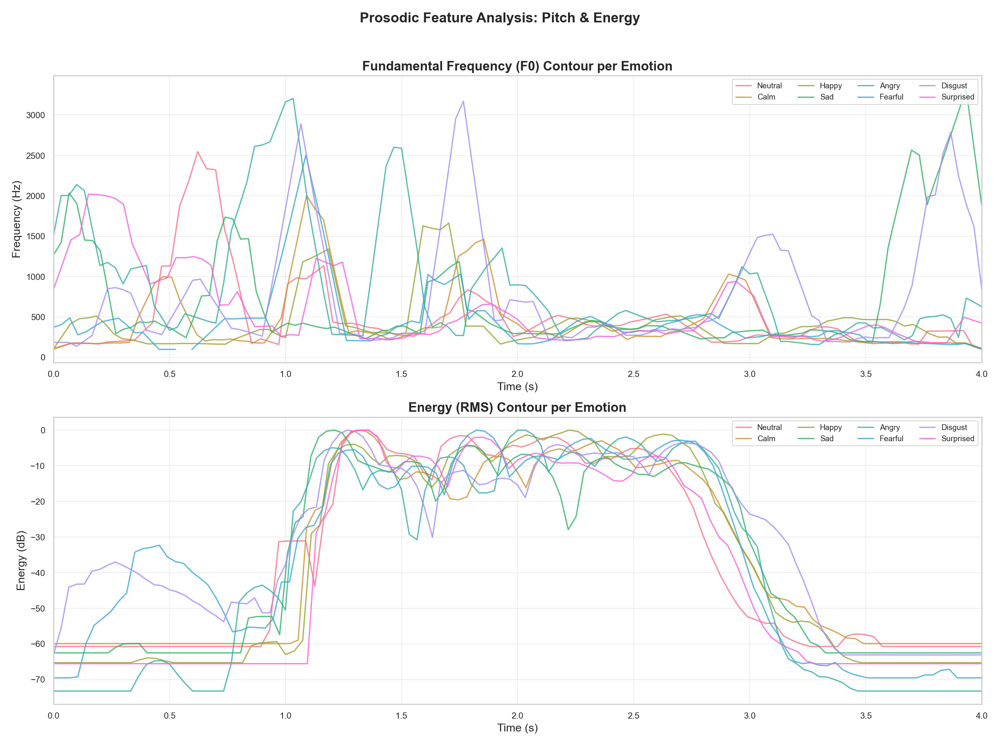
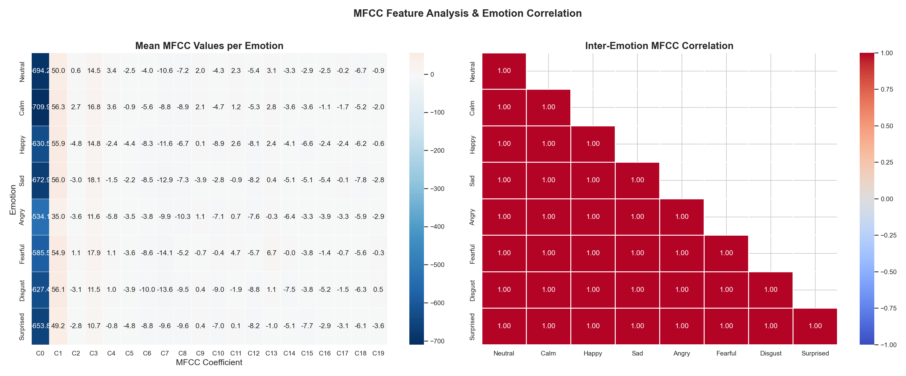
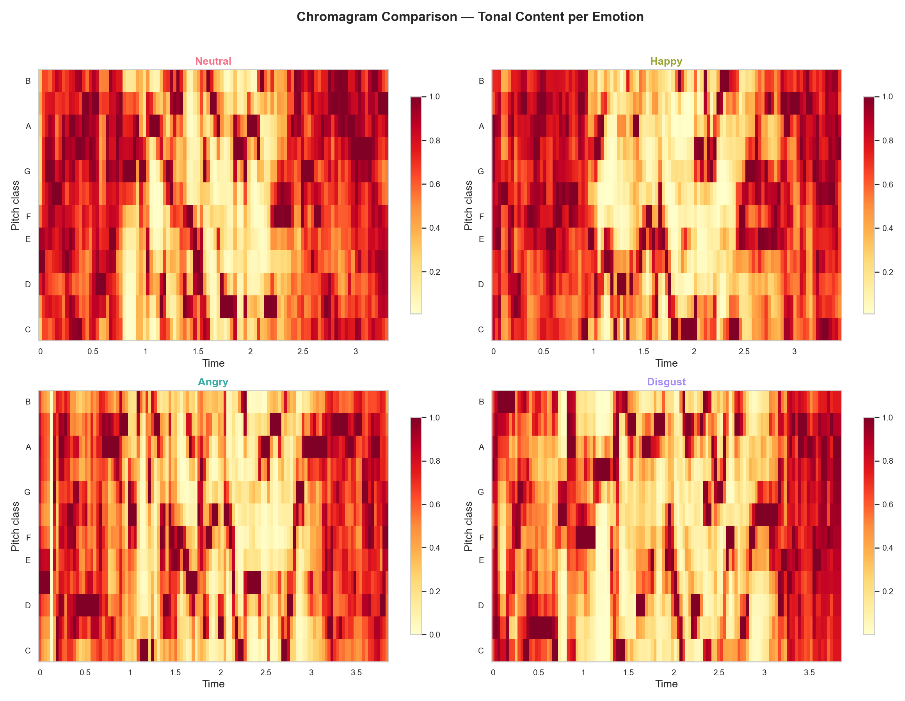
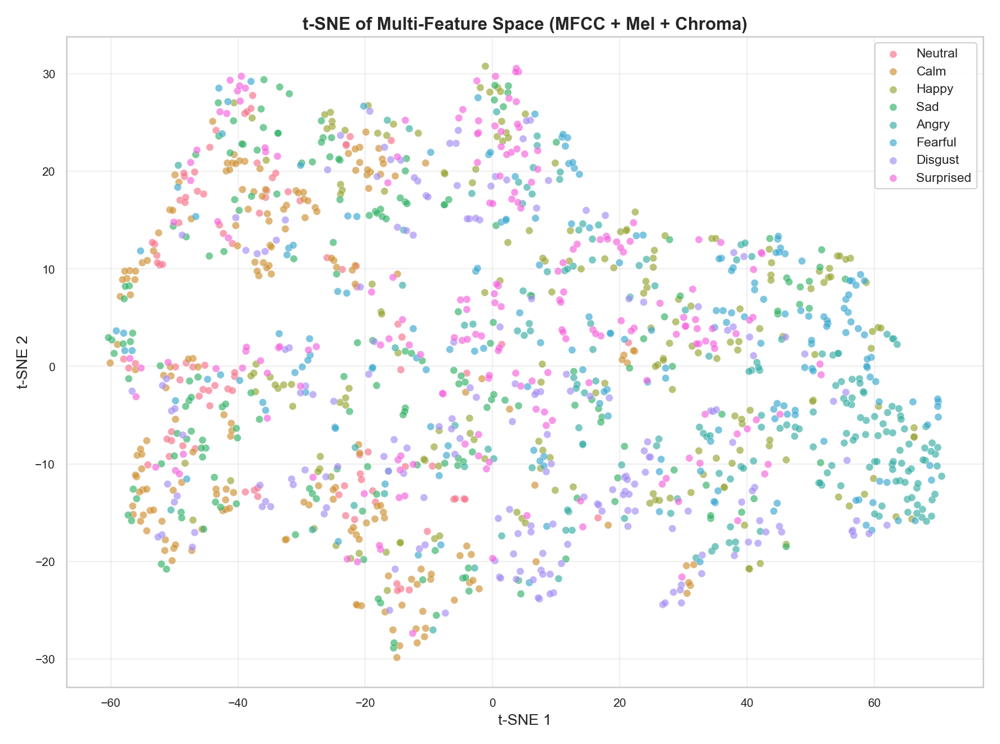
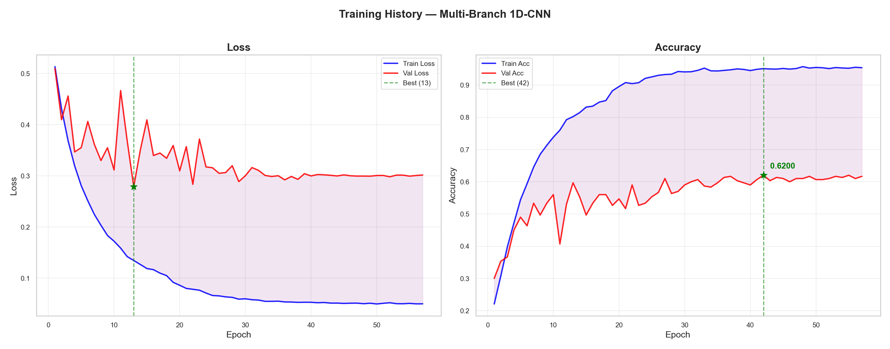
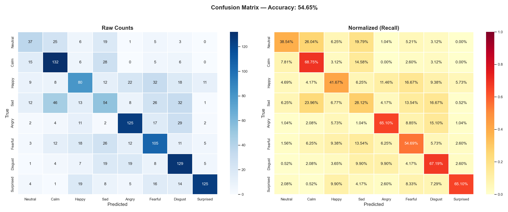
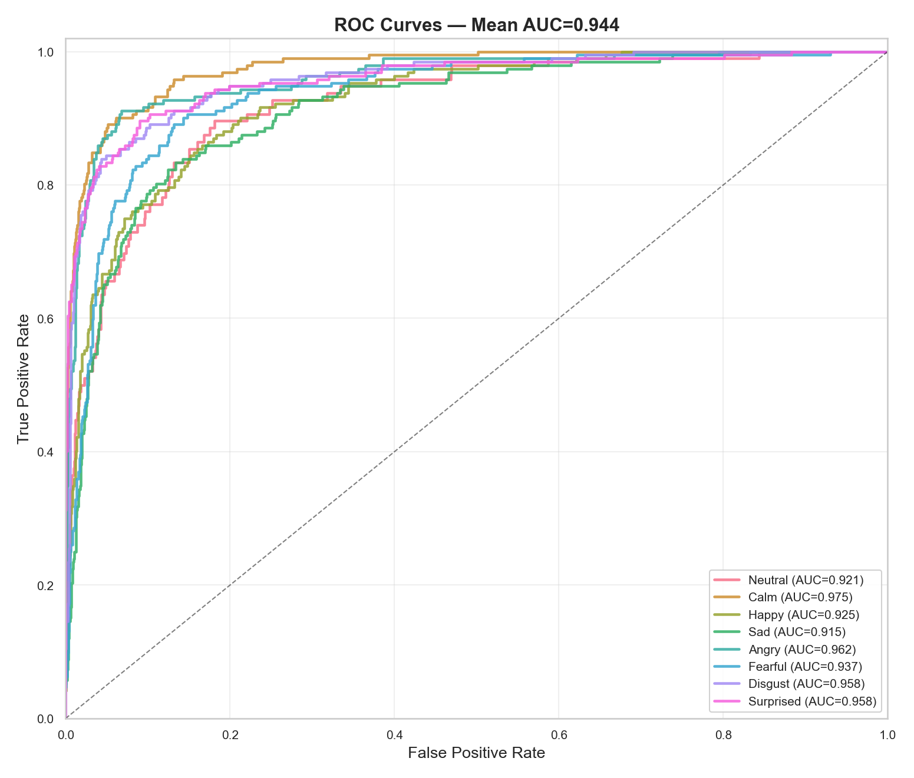
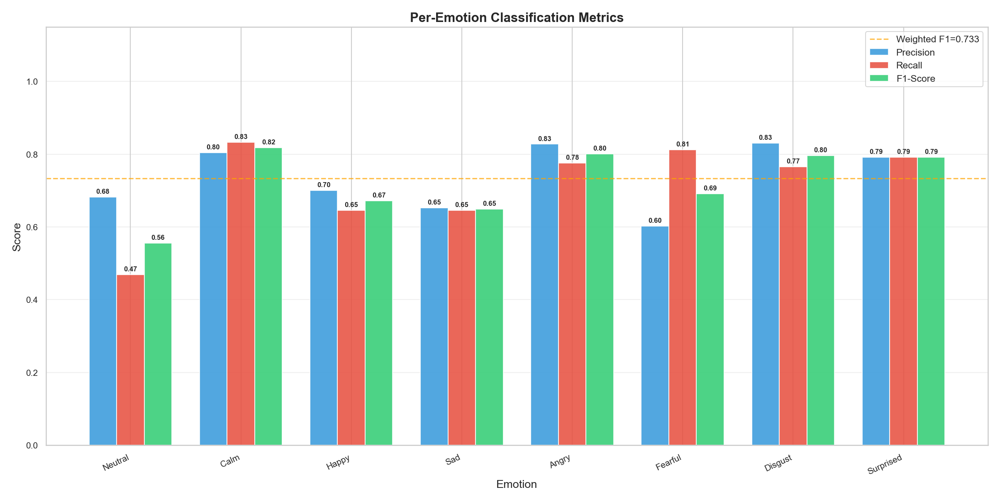

# Speech Emotion Recognition — RAVDESS Dataset

## Results

| Metric | Value |
|--------|-------|
| **Mean Accuracy** | **73.40%** |
| **Mean F1 Score** | **72.98%** |
| **Std Deviation** | ±3.92% |
| **Evaluation** | 5-Fold StratifiedKFold |

### Per-Fold Accuracy

| Fold 1 | Fold 2 | Fold 3 | Fold 4 | Fold 5 |
|--------|--------|--------|--------|--------|
| 66.67% | 73.96% | 72.92% | 74.65% | 78.82% |

---

## Visualizations

### Pre-Training Analysis

#### 1. Audio Features Analysis
> Waveform, Mel spectrogram, and MFCC heatmap for Sad, Angry, Fearful, and Surprised emotions.

#### 2. Spectrogram Comparison
> Mel spectrogram comparison across all 8 emotions — visualizing acoustic differences in frequency and energy patterns.

#### 3. Pitch & Energy Contours
> Fundamental frequency (F0) and RMS energy contours overlaid for all emotions — key prosodic features for SER.

#### 4. MFCC Feature Correlation
> Mean MFCC coefficient values per emotion and inter-emotion correlation matrix — shows which emotions share similar spectral characteristics.

#### 5. Chromagram Comparison
> Tonal content (chroma features) across selected emotions — captures harmonic and pitch class information.

#### 6. t-SNE Dimensionality Reduction
> 2D projection of the combined MFCC + Mel + Chroma feature space — reveals natural clustering and overlap between emotion classes.

---

### Post-Training Analysis

#### 7. Training History
> Loss and accuracy curves across epochs with best epoch markers — monitors convergence and overfitting.

#### 8. Confusion Matrix
> Raw count and normalized confusion matrices — identifies systematic misclassification patterns between emotion pairs.

#### 9. ROC Curves
> One-vs-Rest ROC curves with per-class AUC scores — evaluates sensitivity/specificity trade-off for each emotion.

#### 10. Per-Emotion Performance
> Precision, Recall, and F1-Score breakdown for each emotion — highlights class-level strengths and weaknesses.

